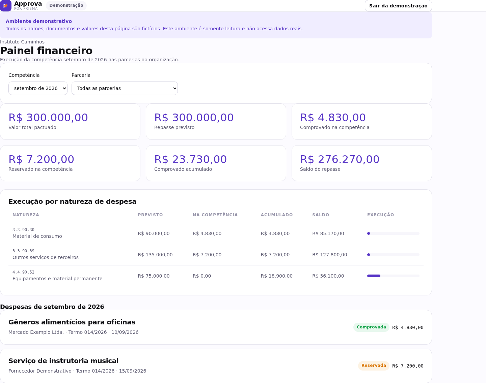
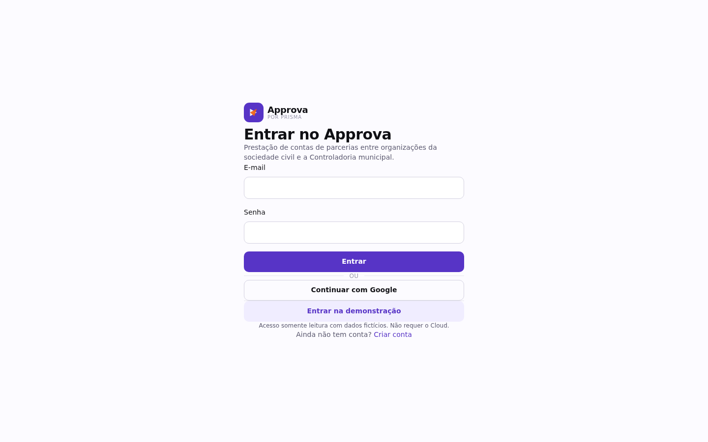

<div align="center">

# Approva

**Gestão e prestação de contas de parcerias entre Prefeituras e OSCs — Lei 13.019/2014**


</div>

> 📌 **Este é um repositório de portfólio, não o código-fonte de produção.**
> O sistema Approva é comercializado como serviço para prefeituras do Paraná; o
> código de produção, o schema de banco de dados e as regras de negócio são
> proprietários e não são publicados aqui. Este repositório existe para descrever
> a arquitetura da solução e mostrar uma amostra do design system de interface.
> Veja [Sobre este repositório](#sobre-este-repositório) no final.

---

## O problema

Prefeituras do Paraná repassam recursos públicos a OSCs (organizações da sociedade civil)
através de parcerias/convênios regidos pela **Lei 13.019/2014** e fiscalizados pelo
**TCE-PR**. Na prática, essa prestação de contas hoje é feita majoritariamente em
planilhas soltas, papel e e-mail:

- OSCs perdem prazos de certidões, cometem erros de classificação de despesa e dependem
  de contador para cada guia paga.
- Prefeituras (Controladoria) só descobrem um problema quando já é tarde — não há visão
  consolidada de todas as parcerias do município em um único lugar.
- Cotações de fornecedores exigem que o fornecedor tenha login em algum sistema, o que
  na prática não acontece.

## A proposta do Approva

Uma plataforma web onde **OSC e Controladoria municipal operam na mesma parceria**, cada
uma com sua visão e permissões:

| Funcionalidade | O que resolve |
|---|---|
| **Configuração colaborativa da parceria** | Plano de aplicação, cronograma e regras definidos junto com o município, uma única vez. |
| **Certidões com alerta de validade** | Evita a descoberta tardia de certidão vencida. |
| **Cotação por link seguro, sem login** | Fornecedor recebe um link com token, envia proposta sem precisar criar conta. |
| **Leitura automática de documentos** | Extrai e preenche automaticamente dados de notas fiscais/guias a partir do arquivo enviado. |
| **Lançamento direto de despesas** | Folha de pagamento, guias fiscais e despesas recorrentes lançadas com validação de enquadramento. |
| **Painel financeiro em tempo real** | Visão de saldo, execução e desvios por parceria. |
| **Visão consolidada da Controladoria** | Um município enxerga todas as suas parcerias em um único painel, sem depender de relatório manual da OSC. |
| **Documentos com hash de verificação** | Cada documento (recibo, comprovante) gerado tem código + hash, verificável posteriormente. |
| **Trilha de auditoria imutável** | Toda ação relevante é registrada de forma que não pode ser alterada ou apagada, nem por um administrador do sistema. |

O nome comercial do sistema é **Approva**; a empresa por trás é a **Prismatech LTDA**.

## Capturas de tela

<table>
<tr>
<td width="50%">

**Painel financeiro sem polimento de UI/UX Design (ambiente demonstrativo)**


</td>
<td width="50%">

**Tela de acesso/login** com Auth via Google implementado


</td>
</tr>
<tr>
<td width="50%" colspan="2">


</td>
</tr>
</table>

## Arquitetura (visão geral, sem código de produção)

```
                    ┌─────────────────────────────┐
                    │   Navegador (React 19 SSR)  │
                    └──────────────┬──────────────┘
                                   │
                    ┌──────────────▼──────────────┐
                    │  Camada de aplicação web     │
                    │  (roteamento + funções de    │
                    │   servidor, TypeScript)      │
                    └──────────────┬──────────────┘
                                   │
                    ┌──────────────▼──────────────┐
                    │  Banco de dados relacional   │
                    │  com controle de acesso por  │
                    │  linha (RLS) em 100% das     │
                    │  tabelas + trilha de         │
                    │  auditoria imutável          │
                    └─────────────────────────────┘
```

- **Frontend**: React 19 com renderização no servidor, TypeScript, Tailwind CSS,
  design system próprio (amostra neste repositório).
- **Backend/dados**: banco de dados Postgres com Row Level Security ativado em
  **100% das tabelas**, autenticação e armazenamento de arquivos com controle de acesso.
- **Build/deploy**: pipeline de build com saída SSR, deployável em infraestrutura serverless.
- **Testes**: suíte automatizada cobrindo regras de negócio e isolamento de dados entre
  organizações/municípios.
- **Geração de documentos**: PDFs com código e hash de verificação de integridade.

### Números do projeto (produção, não deste repositório)

- **~21.500 linhas** de código TypeScript/TSX
- **129 componentes** de interface, **16 rotas**
- **30 tabelas** no schema do banco, **96 políticas de controle de acesso por linha**
- **11 arquivos de teste** automatizado (unitários + integração)

## Decisões de segurança que valem destacar

Dado que o sistema lida com dinheiro público e dados de terceiros, a segurança foi
tratada como requisito de primeira classe, não como reboco:

1. **Controle de acesso por linha em todas as tabelas** — nenhuma tabela é acessível
   sem regra explícita; validado com testes automatizados que garantem que uma OSC não
   enxerga a parceria de outra **nem tentando acessar por ID direto**, e que a
   Controladoria só enxerga parcerias do seu próprio município.
2. **Papéis de usuário isolados e não editáveis pelo próprio usuário** (proprietário,
   administrador, membro, controlador, servidor técnico), com regra de exclusividade do
   vínculo (organização **ou** município, nunca os dois ao mesmo tempo).
3. **Token de fornecedor para cotação pública** — o fornecedor acessa via link com token,
   mas o token nunca é armazenado em texto puro: apenas seu hash é persistido.
4. **Auditoria imutável** — a trilha de eventos de auditoria é protegida de forma que
   nem atualização nem exclusão são permitidas por ninguém, incluindo administradores
   do sistema; os registros só entram através de um mecanismo de banco de dados
   controlado, nunca diretamente pela aplicação.
5. **Documentos verificáveis** — todo documento gerado (recibo, comprovante) carrega um
   código e um hash, permitindo conferência posterior de que o conteúdo não foi alterado.
6. **Segredos fora do código** — nenhuma chave de servidor, senha ou token está em
   qualquer repositório; toda configuração sensível vive em variáveis de ambiente do
   ambiente de produção.

## Amostra de código: design system de interface

A pasta [`amostra-design-system/`](./amostra-design-system) contém uma seleção de
componentes de UI reutilizáveis do produto (botões, cards, tabelas, campos de
formulário, navegação). São componentes **puramente visuais** — não contêm regra de
negócio, não se conectam a banco de dados e não representam a arquitetura de dados
real do sistema. Servem apenas para ilustrar padrão de código, uso de TypeScript e
organização de componentes.

## Sobre este repositório

Este repositório é um material de portfólio, não um espelho do código de produção.
Por isso, propositalmente **não estão aqui**:

- O schema do banco de dados e suas regras de negócio.
- A lógica de cálculo financeiro, cotações, contratos, folha de pagamento e geração
  de relatórios oficiais (REO, Despesa.txt/TCE-PR).
- As integrações de autenticação, sessão e autorização.
- As telas específicas de cada módulo do produto (financeiro, cotações, controladoria).

Isso é intencional: o Approva é um produto comercial em operação, e o código completo
não é disponibilizado publicamente para evitar reprodução por terceiros.

Uso deste repositório: consulte a licença em [`LICENSE`](./LICENSE). Em resumo — a
leitura é livre, mas cópia, redistribuição ou reaproveitamento do conteúdo para
construir produtos próprios ou concorrentes não é permitida.

---

<div align="center">

Feito por [PrismaTech](https://github.com/l7hmarque)

</div>
